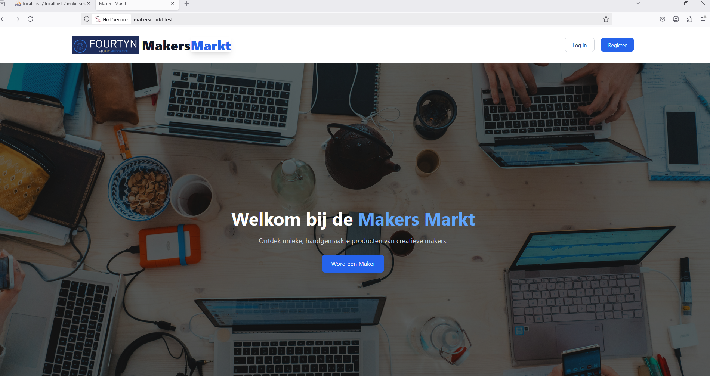
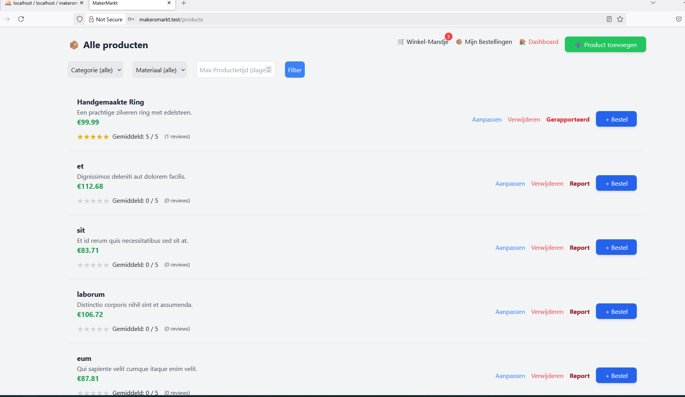
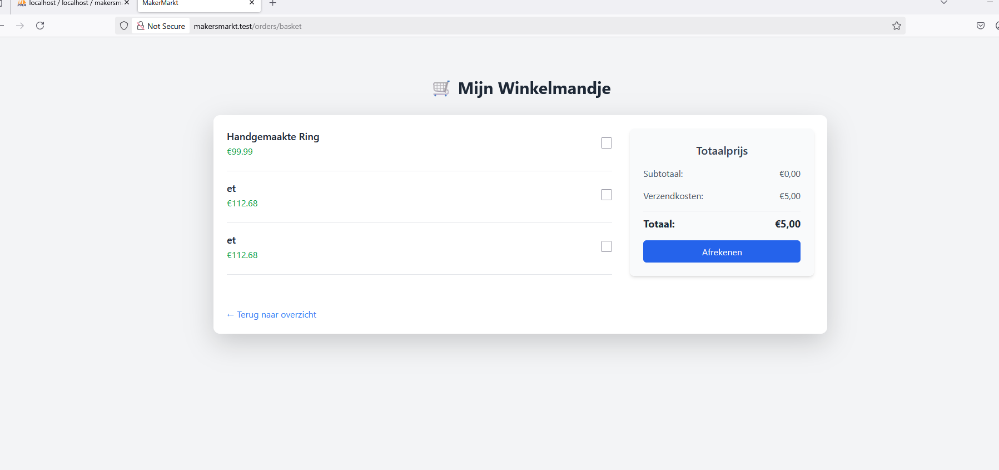

# MakersMarkt 🎨

Een Laravel-project waarmee makers handgemaakte producten kunnen verkopen. Klanten kunnen bestellen, reviews geven, en moderatoren beheren het platform. 

⚠️ **Ik heb deze repository openbaar gezet voor mijn sollicitaties. Ik heb het project helemaal zelf gebouwd en speciaal gemaakt voor mijn stage-sollicitaties**

## 🔧 Gebouwd met
- Laravel 12
- Tailwind CSS
- Blade templates
- Eloquent ORM

## ✨ Functionaliteiten
- ✅ Productbeheer (CRUD)
- 🛒 Winkelmandje en bestellingen
- 🧑‍💼 Rolgebaseerde dashboards (rollen: maker, koper, moderator)
- 🔐 Beveiligde login/registratie
- 📊 Review- en rapportage systeem (voor producten)

## 📸 Screenshots
**Een paar eenvoudige screenshots om te laten zien hoe de website eruitziet**





## -------------------------------------------------------------------------------------------------------

## 🧪 Installatie-instructies

Volg deze stappen om het project te klonen en lokaal op te zetten:

1. **Kloon het project vanaf GitHub:**
   ```
   git clone <repository-url>
   cd <repository-name>
   ```

3. **Installeer vereiste pakketten met Composer:**
   ```
   composer install
   ```

4. **Maak een `.env` bestand:**
   - Dupliceer het `.env.example` bestand naar `.env`:
     copy .env.example .env
   - Pas de `.env` instellingen aan, zoals databaseconfiguratie, en vul een `APP_KEY` in.

5. **Genereer een app-sleutel:**
   ```
   php artisan key:generate
   ```

6. **Voer de migraties en seeder uit:**
   ```
     php artisan migrate
     php artisan db:seed
   ```

7. **Start de Laravel server:**
   ```
   php artisan serve
   ```
   
8. **Open het project in je browser:**
   - Ga naar `http://localhost:8000` om de applicatie te bekijken.

Nu ben je klaar om te beginnen met het gebruik van de applicatie en het implementeren van de vereiste functionaliteiten.


